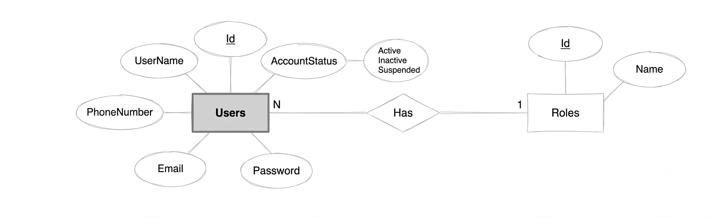
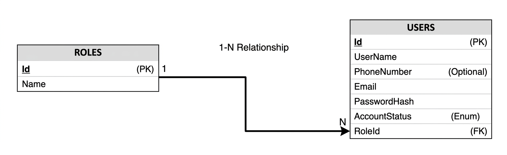
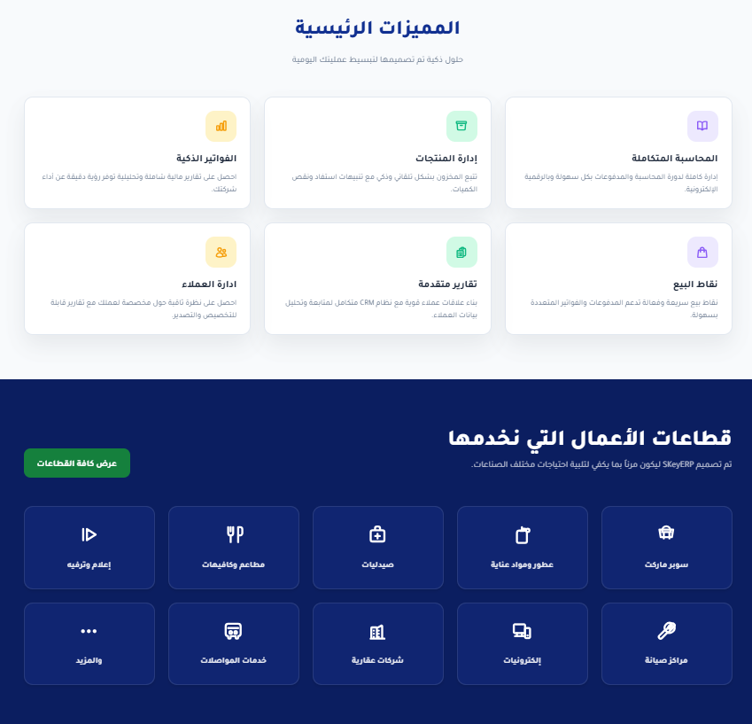
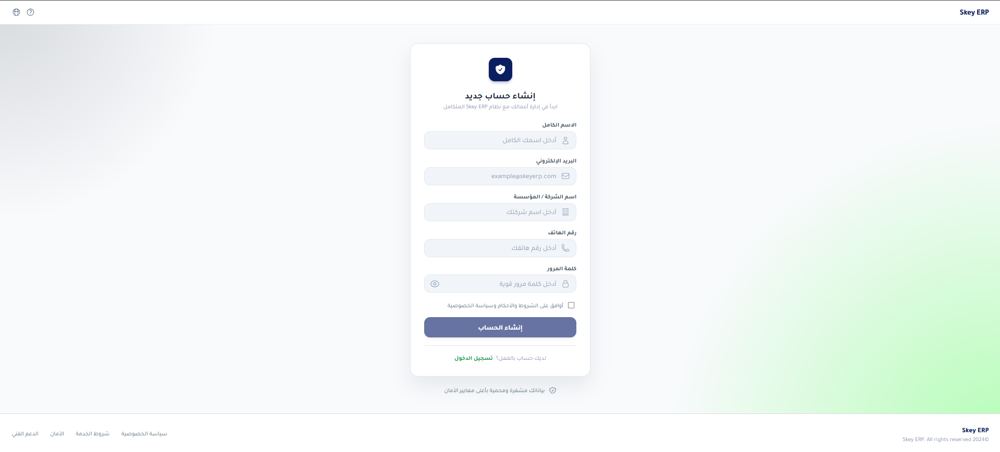
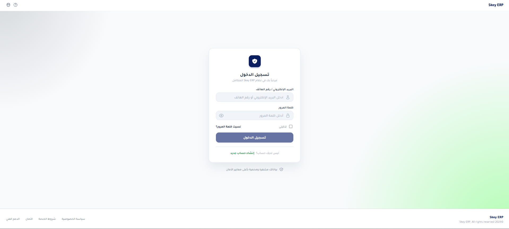
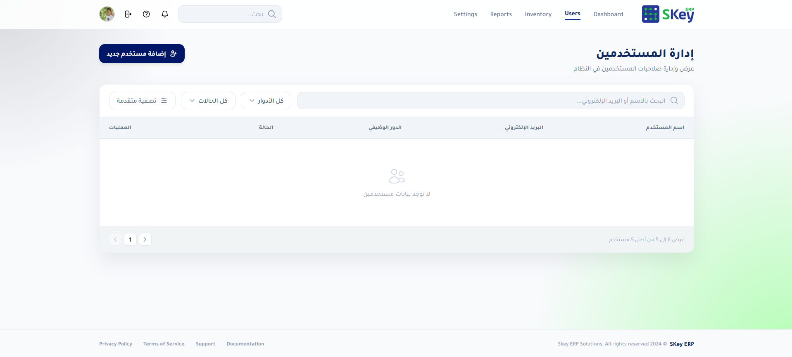
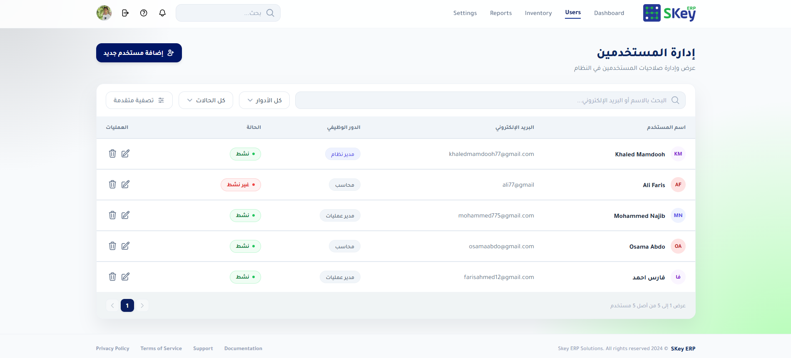
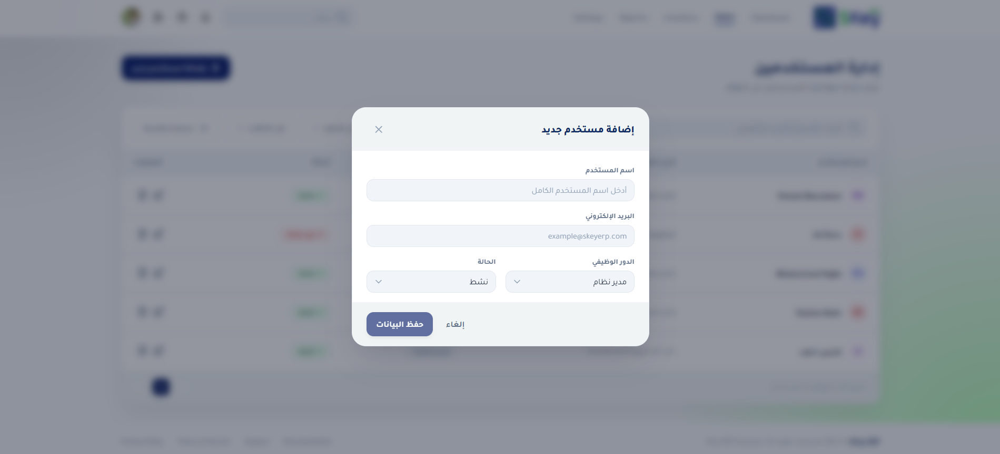
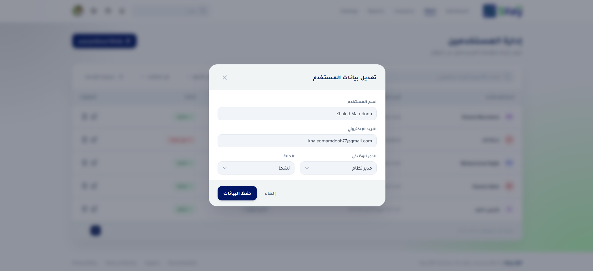

<div dir="rtl">

<h1 align="center">SKey ERP — نظام إدارة المؤسسات المتكامل</h1>

<p align="center">
  
  
  
  
  
</p>

---

## مقدمة

&rlm;**SKey ERP** هو نظام لإدارة المؤسسات (ERP) بواجهة عربية كاملة (RTL)، يُظهر القدرة على بناء تطبيق
كامل Full-Stack بقواعد Clean Architecture مع ممارسات تطويرية احترافية.

الفكرة الأساسية: نظام يتيح تسجيل الدخول الآمن، إدارة المستخدمين والأدوار والصلاحيات،
مع واجهة أمامية حديثة وسهلة الاستخدام، وقاعدة بيانات مرنة قابلة للتوسع.

---


##  المعمارية والهيكلية الهندسية

### &rlm;Backend — Clean Architecture


| الطبقة | مسؤوليتها | مثال |
|--------|-----------|------|
| `Domain` | الكيانات والقواعد الأساسية | `User`, `Role`, `AccountStatus` |
| `Application` | منطق التطبيق و DTOs | `IUserService`, `CreateUserDto` |
| `Infrastructure` | خدمات خارجية | `BCrypt PasswordHasher` |
| `Persistence` | تخزين البيانات | `AppDbContext`, `UserService implementation` |
| `Web API` | نقاط الوصول | `UsersController` |


**فائدة هذا التقسيم:**
- **فصل المسؤوليات** — كل طبقة تعنى بجزء محدد من التطبيق
- **قابلية التوسع** — يمكن استبدال أي طبقة دون التأثير على الأخرى
- **سهولة الاختبار** — إمكانية اختبار كل طبقة بشكل مستقل
- **إعادة الاستخدام** — يمكن إعادة استخدام Domain و Application في مشاريع أخرى


### &rlm;Frontend — Angular

الواجهة الأمامية مبنية بأنماط Angular الحديثة:

- **&rlm;Standalone Components** — جميع المكونات مستقلة (لا حاجة لـ NgModules)
- **&rlm;Signals** — إدارة الحالة باستخدام Signals لتغيير أداء أفضل
- **&rlm;Lazy Loading** — تحميل الصفحات عند الطلب (Dashboard, Users, Inventory...)
- **&rlm;Route Guards** — حماية المسارات بحراس authGuard و guestGuard
- **&rlm;RTL / العربية** — واجهة كاملة بالعربية مع خط Tajawal

---

##  الميزات والوظائف

###  إدارة المستخدمين والأدوار

| الميزة | الوصف |
|--------|-------|
| إنشاء مستخدم | إضافة مستخدم جديد مع تحديد الدور |
| تعديل بيانات | تحديث معلومات المستخدم (الاسم، البريد، الدور، الحالة) |
| حذف مستخدم | حذف المستخدم مع تأكيد أمني |
| أدوار متعددة | Admin, Accountant, Manager |
| فلترة وبحث | تصفية المستخدمين حسب الاسم، البريد الإلكتروني، الدور، الحالة |

###  الأمان والتحقق

- **&rlm;JWT Tokens** — توثيق آمن باستخدام JSON Web Tokens مع توقيع متماثل
- **&rlm;BCrypt Hashing** — تشفير كلمات المرور بأحدث معايير BCrypt.Net
- **تسجيل دخول مرن** — دعم تسجيل الدخول بالبريد الإلكتروني أو رقم الهاتف
- **&rlm;Route Guards** — حراس مسارات Angular تمنع الوصول غير المصرح به

###  قاعدة البيانات والبذر التلقائي

- **&rlm;EF Core Code-First** — تصميم قاعدة البيانات من خلال الكود
- **الترحيل التلقائي** — `context.Database.Migrate()` عند بدء التشغيل في بيئة التطوير
- **بذر البيانات الأولية** — إدخال بيانات البذور (الأدوار الأساسية) تلقائياً

###  توثيق الواجهات

- **&rlm;Scalar API Reference** — توثيق تفاعلي حديث للـ APIs
- متاح على `/scalar/v1` مع واجهة أنيقة

---


## كيفية التشغيل

### المتطلبات الأساسية

| الأداة | الغرض | تنزيل |
|--------|-------|-------|
| .NET 9 SDK | تشغيل Backend | [dotnet.microsoft.com](https://dotnet.microsoft.com/download) |
| Node.js 22 LTS | تشغيل Frontend | [nodejs.org](https://nodejs.org/) |
| SQL Server | قاعدة البيانات | Developer / Express |
| Angular CLI 21 | أدوات Angular | `npm install -g @angular/cli` |

### خطوات التشغيل

#### 1. إعداد قاعدة البيانات

1. تأكد من تشغيل SQL Server المحلي
2. في الملف `SKeyAPI/SKeyAPI/appsettings.json`، عدّل ConnectionString:

```json
{
  "ConnectionStrings": {
    "DefaultConnection": "Server=YOUR_SERVER;Database=SKeyTaskDB;Trusted_Connection=True;TrustServerCertificate=True;"
  }
}
```


#### 2. تشغيل Backend

```bash
cd SKeyAPI
dotnet run --project SKeyAPI/SKeyAPI.csproj
```

- يشتغل على: `https://localhost:7130`  و  `http://localhost:5049`
- Scalar API Reference: `http://localhost:5049/scalar/v1`
- ترحيل قاعدة البيانات والبذر يحدث **تلقائياً**


#### 3. تشغيل Frontend

```bash
cd Angular/SKeyFront
npm install
npm start
```

- يشتغل على: `http://localhost:4200`

### بيانات الدخول الافتراضية (Seed Data)

| الحقل | القيمة |
|-------|--------|
| البريد الإلكتروني | `Khaledmamdooh77@gmail.com` |
| كلمة المرور | `KHaled@123456` |

---

## &rlm;Backend Packages
-  قائمة الحزم الأساسية المثبتة على ملفات المشروع:


| Package | Version | Purpose |
|---------|---------|---------|
| BCrypt.Net-Next | 4.2.0 | Password hashing using the BCrypt algorithm. |
| Microsoft.AspNetCore.Authentication.JwtBearer | 10.0.10 | JWT Bearer authentication for securing APIs. |
| Microsoft.EntityFrameworkCore.SqlServer | 10.0.10 | SQL Server provider for Entity Framework Core. |
| Microsoft.EntityFrameworkCore.Tools | 10.0.10 | Entity Framework Core migration and scaffolding tools. |
| Scalar.AspNetCore | 2.16.16 | Interactive API documentation and testing interface based on OpenAPI. |


##  مسارات API الأساسية

| الطريقة | المسار | الوصف |
|---------|--------|-------|
| `POST` | `/api/users/register` | تسجيل مستخدم جديد |
| `POST` | `/api/users/signin` | تسجيل الدخول |
| `POST` | `/api/users/create` | إنشاء مستخدم (إداري) |
| `PUT` | `/api/users/update` | تعديل بيانات مستخدم |
| `DELETE` | `/api/users/{id}` | حذف مستخدم |
| `GET` | `/api/users` | جلب جميع المستخدمين |

جميع الاستجابات تتبع النمط التالي:

```json
{
  "isSuccess": true,
  "message": "تمت العملية بنجاح",
  "data": { }
}
```
---

## هيكلية المشروع

```
SKey-ERP_Task/
│
├── SKeyAPI/                          # ── Backend · .NET 9 ──
│   ├── SKeyAPI.slnx                  #   Solution file
│   │
│   ├── SKey.Domain/                  #  1. طبقة المجال
│   │   ├── Entities/                 #     User.cs, Role.cs
│   │   └── Enums/                    #     AccountStatus.cs
│   │
│   ├── SKey.Application/             #  2. طبقة التطبيق
│   │   ├── DTOs/                     #     CreateUserDto, UpdateUserDto ...
│   │   └── Interfaces/               #     IUserService.cs
│   │
│   ├── SKey.Infrastructure/          #  3. طبقة البنية التحتية
│   │   └── Services/                 #     PasswordHasher.cs (BCrypt)
│   │
│   ├── SKey.Persistence/             #  4. طبقة البيانات
│   │   ├── Context/                  #     AppDbContext.cs + Seed Data
│   │   ├── Migrations/               #     EF Core Migrations
│   │   └── Services/                 #     UserService.cs, JwtTokenGenerator.cs
│   │
│   └── SKeyAPI/                      #  5. Web API
│       ├── Controllers/              #     UsersController.cs
│       ├── Program.cs                #     نقطة البداية + Auto Migration
│       └── appsettings.json          #     الإعدادات
│
└── Angular/SKeyFront/                # ── Frontend · Angular 21 ──
    └── src/
        ├── app/
        │   ├── core/                 #  خدمات أساسية
        │   │   ├── guards/           #    auth.guard, guest.guard
        │   │   ├── interceptors/     #    auth.interceptor (JWT injection)
        │   │   └── services/         #    auth.service (login, register, logout)
        │   │
        │   ├── features/             #  الصفحات
        │   │   ├── landing/          #    الصفحة الرئيسية
        │   │   ├── auth/             #    Login, Register
        │   │   ├── users/            #    إدارة المستخدمين
        │   │   ├── dashboard/        #    لوحة التحكم
        │   │   ├── inventory/        #    المخزون (قابل للتوسع)
        │   │   ├── reports/          #    التقارير
        │   │   └── settings/         #    الإعدادات
        │   │
        │   ├── layouts/              #  تخطيطات (Auth, Main مع Sidebar)
        │   └── shared/ui/            #  مكونات مشتركة (Button, Input, Select, Card)
        │
        └── environments/             #  إعدادات API URL
            └── environment.ts        #    https://localhost:7130/api
```

---

## المخططات 
### &rlm;ER Diagram


<p align="center">
  
</p>

### &rlm;Relational Scheme

<p align="center">
  
</p>

---

## واجهات المستخدم (User Interfaces)

### &rlm;Landing Page

<p align="center">
  
</p>


<p align="center">
  
</p>

<p align="center">
  
</p>

### &rlm;Auth (register & signin)

<p align="center">
  
</p>

<p align="center">
  
</p>

### &rlm;User Management

<p align="center">
  
</p>

<p align="center">
  
</p>

<p align="center">
  
</p>

<p align="center">
  
</p>


## خلاصة

هذا المشروع يُظهر القدرة على:

- **تصميم وتنفيذ Clean Architecture** حقيقية بفصل واضح بين الطبقات
- **تطبيق معايير أمان** (JWT, BCrypt, Route Guards)
- **بناء واجهة أمامية حديثة** (Angular 21, Signals, Standalone Components, RTL)
- **أتمتة العمليات** (Auto Migration, Auto Seeding)
- **كتابة كود نظيف وقابل للصيانة والتوسع**

